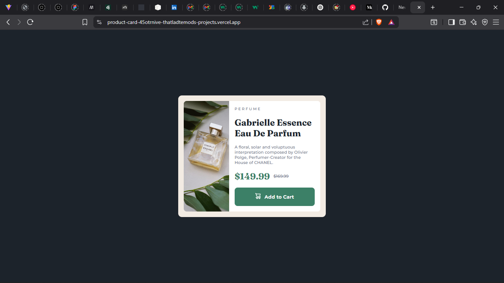

# Frontend Mentor - Product preview card component solution

This is a solution to the [Product preview card component challenge on Frontend Mentor](https://www.frontendmentor.io/challenges/product-preview-card-component-GO7UmttRfa). Frontend Mentor challenges help you improve your coding skills by building realistic projects.

## Table of contents

- [Overview](#overview)
  - [The challenge](#the-challenge)
  - [Screenshot](#screenshot)
  - [Links](#links)
- [My process](#my-process)
  - [Built with](#built-with)
  - [What I learned](#what-i-learned)
  - [Continued development](#continued-development)
  - [Useful resources](#useful-resources)
- [Author](#author)
- [Acknowledgments](#acknowledgments)

## Overview

### The challenge

Users should be able to:

- View the optimal layout depending on their device's screen size
- See hover and focus states for interactive elements

### Screenshot



### Links

- Solution URL: [https://github.com/thatladtemod/Product-Card](https://github.com/thatladtemod/Product-Card)
- Live Site URL: [https://product-card-45otrnive-thatladtemods-projects.vercel.app/](https://product-card-45otrnive-thatladtemods-projects.vercel.app/)

## My process

### Built with

- Semantic HTML5 markup
- CSS custom properties
- Flexbox
- CSS Grid
- Mobile-first workflow
- [React](https://reactjs.org/) - JS library
- [Vite](https://vitejs.dev/) - Build tool

### What I learned

During this project, I learned how to:

- Structure a React component-based project for a simple product card UI.
- Use CSS custom properties and modern layout techniques (Flexbox, Grid) for responsive design.
- Implement mobile-first styling and switch images based on screen size.
- Apply hover and active states for better user interaction.

**Example: Responsive image switching in React**

```jsx


```

**Example: Button hover effect in CSS**

```css
.add-to-cart:hover {
  background-color: hsl(158, 42%, 25%);
}
```

### Continued development

In future projects, I want to:

- Explore more advanced accessibility features for interactive components.
- Practice using styled-components or CSS modules for scoped styling.
- Add unit and integration tests for React components.

### Useful resources

- [Frontend Mentor](https://www.frontendmentor.io/) - For real-world UI challenges.
- [MDN Web Docs](https://developer.mozilla.org/) - For HTML, CSS, and JavaScript references.
- [React Documentation](https://reactjs.org/docs/getting-started.html) - For React concepts and API.

## Author

- Frontend Mentor - [@thatladtemod](https://www.frontendmentor.io/profile/thatladtemod)
- GitHub - [thatladtemod](https://github.com/thatladtemod)

## Acknowledgments

Thanks to the Frontend Mentor community for feedback and inspiration!